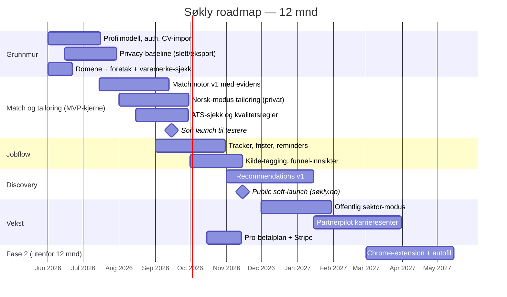

# Søkly — Business case og roadmap

> Living document. Eier: Brage. Sist oppdatert: 2026-05-08.
> Skal leses sammen med [STRATEGY.md](./STRATEGY.md) og [MARKET_ANALYSIS.md](./MARKET_ANALYSIS.md).

---

## 1. Kort sammendrag

**Hva:** Søkly er et norsk jobbsøker-operativsystem. Én flate som samler discovery, match, tailoring, tracking og oppfølging — for jobbsøkere som vil ha kontroll, ikke spam.

**Hvorfor nå:** AI-skriving er mainstream (FINN 2025: 1/3 jobbsøkere bruker AI). Norske aktører eier hver sin smale skive; ingen eier helheten. Internasjonale verktøy mangler norsk språk, offentlig sektor og lokal tillit. Hullet er åpent.

**Hvordan:** Bygg kjernen i 9–12 måneder med MVP fokusert på match + norsk tailoring + jobflow + recommendations + privacy. Lanser betalt Pro-plan i NOK uten credits-kaos. Distribuer via SEO, organisk vekst og partnerpilot fra fase 2.

**Forventet resultat innen 12 mnd:**
- 3 000–8 000 registrerte brukere
- 5–10 % free-to-paid (≈ 250–600 betalende)
- ARPU 79–99 kr/mnd → MRR 20–60 kr i tusen, dvs. 20–60 000 kr/mnd
- Fundament for B2B2C-pilot og varemerke-registrering i 2027

---

## 2. Problem

Jobbsøking i 2026 er kaotisk for den enkelte:

- En jobbannonse i én fane, CV i en mappe, søknad i et dokument, frister i hodet, oppfølging ingen steder.
- AI-verktøy gjør én ting hver — generere tekst, sjekke ATS, finne jobber. Brukeren limer dem sammen manuelt.
- Norske jobbsøkere må forholde seg til norsk skrivestil, offentlig sektor-prosesser, og en tillitskultur der personvern og redelighet er viktigere enn i USA.
- Eksisterende norske verktøy er enten dokumentskrivere (Jobbfikser, Jobbsoknader.no), arbeidsrom (Søknadsbasen, EnkelCV) eller automasjon (Autosøk). Ingen er en hel arbeidsflyt.

**Konsekvens for brukeren:** scattered, gjentakende arbeid, missed deadlines, generiske søknader, lav mestringsfølelse.

---

## 3. Løsning

Søkly er én flate som svarer på "hva er jobben min i jobbsøket i dag?".

**Kjerneflyt (MVP):**

1. **Profil + CV-import** — én sannhetskilde for hva brukeren faktisk har gjort.
2. **Transparent match** — krav-for-krav: dekket / delvis / mangler, med evidens fra CV.
3. **Norsk tailoring** — CV/søknad i norsk stil, valg for privat / offentlig sektor / "uten søknadsbrev".
4. **Jobflow/tracker** — frister, oppfølging, kilder, neste handling. Tracker som vane, ikke board.
5. **Anbefalinger** — relevante jobber fra Arbeidsplassen/NAV + utvalgte arbeidsgiversider.
6. **Privacy som produktlag** — slett/eksporter, "ikke til modelltrening"-løfte, audit log, EU-hosting.

**Designprinsipp:** Klarere, raskere eller roligere i morgen. Hvis ikke — ikke bygg det.

---

## 4. Marked og målgruppe

### Marked

- Norge: ca. 200 000 aktive jobbsøkere til enhver tid (NAV/SSB-tall, fluktuerer).
- Antar 15–25 % er villige til å betale for et verktøy som hjelper. Det gir et adresserbart segment på 30 000–50 000 personer.
- Konkurrenter (Søknadsbasen, Lønna, EnkelCV, Cvenn, Autosøk) har til sammen anslagsvis 20–60 000 betalende brukere. Markedet er ikke modent; mange kandidater bruker fortsatt ChatGPT direkte.

### Primære segmenter

| Segment | Beskrivelse | Verdiløfte |
|---|---|---|
| **Aktive jobbsøkere i privat sektor** | Søker 5–30 jobber, vil ha kvalitet og kontroll | Ett sted å styre alt; transparent match; ærlige drafts |
| **Karrierebyttere / oppsagte** | Høy emosjonell belastning; trenger ritualer | Daglig "hva i dag"; momentum uten skam |
| **Studenter / nyutdannede** | Prisbevisste; lite jobbsøk-erfaring | Gratis-tier som hjelper; lett onboarding |
| **Offentlig sektor-søkere** (fase 2) | Webcruiter/Jobbnorge-prosesser | Egen modus; skjema-støtte; søkerlistehåndtering |
| **Partnerkanaler (B2B2C)** (fase 3) | Karrieresentre, bootcamps, fagforeninger | Distribusjonskanal; cohort-templates |

---

## 5. Konkurransebilde (kort)

Detaljert analyse i [MARKET_ANALYSIS.md](./MARKET_ANALYSIS.md). Hovedposisjoner:

- **Dokumentverktøy** (Jobbfikser, Jobbsoknader.no): smalt, lavpris, ingen workflow.
- **Arbeidsrom** (Søknadsbasen, EnkelCV, Cvenn): tracker + AI-søknad, men ujevn match og svak discovery.
- **Lønnsdata + AI** (Lønna/Jobbe.ai): bredt, men dyrere og komplekst vendor-bilde.
- **Automasjon** (Autosøk, OwlApply): credits, auto-apply, høy compliance-friksjon.
- **Internasjonalt** (Teal, Huntr, Simplify, Jobscan): modne, men engelske og dyre i NOK.

**Søkly-posisjon:** "Det norske jobbsøker-operativsystemet" — vinner på *helhet* + *transparens* + *tillit*, ikke på pris eller automasjon.

---

## 6. Differensiering

| Bet | Hvorfor forsvarbart |
|---|---|
| Transparent match | Få viser krav-for-krav med CV-evidens. Teknisk overkommelig, kommunikativt sterkt. |
| Norsk tailoring (privat/offentlig/"uten søknadsbrev") | Norsk søkepraksis er ikke amerikansk. Lokale regler slår generisk LLM. |
| Jobflow OS | Tracker → ritualer + frister + neste handling. Konkurrenter har board, vi bygger driv. |
| Privacy som produktlag | Eksplisitt datakontroll synlig i UI. Tillitsfordel med substans. |
| Norske anbefalinger | Arbeidsplassen/NAV + arbeidsgiversider. Gjør oss til portal, ikke editor. |

---

## 7. Forretningsmodell

### Pris (foreslått)

| Plan | Pris | Inkludert |
|---|---|---|
| **Gratis** | 0 kr | Profil + CV-import; tracker for inntil 10 aktive søknader; 3 AI-søknader/mnd; anbefalinger fra Arbeidsplassen |
| **Pro** | 99 kr/mnd · 899 kr/år | Ubegrenset tracker og AI-søknader; full match-evidens; offentlig sektor-modus (fase 2); prioritert support; eksport |
| **Intro-tilbud** | 49 kr/mnd første 3 mnd | Konvertering fra gratisbrukere |

**Begrunnelse:**
- 79 kr (Søknadsbasen-paritet) er for lavt — vi vinner ikke på pris. 99 kr signaliserer verdi.
- Årsabonnement 899 kr (≈ 75 kr/mnd) gir 25 % rabatt — standard SaaS-mønster.
- Ingen credits, ingen "fra-priser", ingen pakker. Klarhet er en del av produktet.

### Inntektsforventning (årlig)

| Scenario | Brukere | Free→Paid | Betalende | MRR | ARR |
|---|---|---|---|---|---|
| Pessimistisk (12 mnd) | 3 000 | 5 % | 150 | 14 850 kr | ≈ 178 000 kr |
| Realistisk (12 mnd) | 6 000 | 7 % | 420 | 41 580 kr | ≈ 500 000 kr |
| Optimistisk (12 mnd) | 8 000 | 10 % | 800 | 79 200 kr | ≈ 950 000 kr |

Tall gjelder kun B2C. B2B2C (partner) kan legge på 100–500 betalende seter i 2027.

### Kostnadssider (driftshovedposter)

- Supabase (database + edge functions + storage): 25–250 USD/mnd skalert.
- AI-inferens (LLM-kall for match, tailoring, parsing): 0,5–2 NOK per aktiv søknad. Stor variabel — krever caching og kvotekontroll i Pro.
- Domene + e-post + SaaS-verktøy: ≈ 1 000 kr/mnd.
- Hosting/CDN: 50–200 USD/mnd avhengig av trafikk.

Break-even ligger på ca. **150–250 betalende** med dagens kostnadsbilde.

---

## 8. Go-to-market

### Fase 1 — privat brukstest (mnd 1–3)

- Du selv som primærbruker. Daglig bruk validerer hver feature mot beslutningsfilteret.
- 5–10 venner/nettverk i aktiv jobbsøkmodus får tidlig tilgang. Kvalitative intervjuer.
- Ingen offentlig markedsføring.

### Fase 2 — soft launch (mnd 4–6)

- Lansere `søkly.no` med tydelig "norsk jobbsøker-OS"-budskap.
- SEO-fundament: blogg om jobbsøking, norsk søknadsstil, offentlig sektor.
- Reddit (r/norge, r/Norway, r/jobbnorge), LinkedIn-poster, Bluesky/Mastodon i norske kretser.
- Mål: 500–1 000 registrerte brukere; ≥ 30 betalende.

### Fase 3 — vekst (mnd 7–12)

- Partnerpilot: 1–2 karrieresentre eller bootcamps. Anonymiserte cohort-innsikt.
- Innholdsmarkedsføring: norsk søknadsguide; gratis match-sjekk som leadmagnet.
- Vurder betalt SEM på lavkonkurranse keywords ("søknad offentlig sektor", "jobbsøker app norsk").
- Mål: 3 000–8 000 brukere; 150–800 betalende.

### Fase 4 — skalering (2027+)

- Chrome-extension med autofill (LinkedIn, Webcruiter, Jobbnorge).
- B2B2C: pakke med advisor-dashboard for karrieresentre og fagforeninger.
- Vurder utvidelse til Sverige/Danmark — samme produktlogikk, ny lokalisering.

---

## 9. Roadmap (12 måneder)

### Milepæler

| Når | Milepæl | Suksesskriterium |
|---|---|---|
| 2026-07-01 | Domene + foretak avklart | Kan vi bruke "Søkly", eller må vi rebrande? |
| 2026-09-15 | Soft launch til testere | ≥ 10 brukere, kvalitative tilbakemeldinger på match-forklaring |
| 2026-11-15 | Public soft-launch | ≥ 100 brukere første uken |
| 2027-01-31 | First paying customer cohort | ≥ 50 betalende; churn < 10 %/mnd |
| 2027-04-30 | 12-mnd review | 3 000+ brukere; 150+ betalende; vurder fase 4 |

---

## 10. KPIer

### Produkt

- **Match-to-apply rate** (av matcher med score ≥ 70, hvor mange resulterer i søknad?)
- **Score improvement per jobb** (hvor mye økte scoren etter tailoring?)
- **Aksept-grad på generert tekst** (hvor stor andel beholdes uten manuell redigering?)
- **WAU i tracker** (ukentlig aktive brukere som åpner tracker)
- **Reminder completion rate** (frister/oppfølging fullført innen tidsfrist)

### Vekst

- Free-to-paid konvertering 30/90 dager
- Churn 30/90 dager
- Organisk trafikkandel til signup
- CTR på anbefalte jobber

### Tillit

- Eksport-/slettesuksess innen SLA
- Antall support tickets om personvern (lav er bra)
- NPS for "jeg stoler på at Søkly håndterer dataene mine riktig"

---

## 11. Risiko og mitigering

| Risiko | Sannsynlighet | Konsekvens | Mitigering |
|---|---|---|---|
| Match-løftet undergraves av svak teknisk implementering | Middels | Høy — det er signaturen | Bygg JD-parser + krav-taxonomi tidlig; brukertest forklaringskortet |
| Konkurrent kopierer transparent match-tilnærming | Middels | Middels | Utvid raskt med jobflow + privacy. Det er helheten som er moaten. |
| Personvern-løfter blir markedsføring uten substans | Lav (vi vet bedre) | Høy — undergraver tillit | Vis i UI; dokumentér tekstlig hva vi *ikke* gjør; ekstern audit i 2027 |
| Domene/foretak blokkert av eksisterende aktør | Middels | Middels — krever rebrand | Sjekk samlet før låsing; ha 2–3 alternativer klare |
| LLM-kostnader spiser marginen | Middels | Middels | Caching, kvoter på gratisplan, foretrekk lokal modell der mulig |
| Bruker-akkvisisjon for treg | Høy | Høy | SEO + organisk innhold + partnerpilot. Ikke regn med betalt SEM før 2027. |
| Lønna/Jobbe.ai senker pris og spiser markedet | Lav–middels | Middels | Vinn på opplevd verdi, ikke pris. Pro = 99 kr, ikke 49 kr. |

---

## 12. Beslutninger som kreves nå

1. **Navnelås:** Sjekk `søkly.no`, `sokly.no`, foretaksnavn (Brønnøysund), varemerke (Patentstyret). Beslut etter sjekk. *(Foreslått frist: 2026-06-15.)*
2. **Rebrand i kodebase:** Kodebasen bruker Søkly visuelt og `sokly` som teknisk slug. Endelig markedsnavn låses etter domene-/foretak-/varemerkesjekk.
3. **Pro-pris:** 99 kr/mnd verdiprising vs. 79 kr/mnd Søknadsbasen-paritet. *(Foreslått: 99 kr/mnd + intro 49 kr.)*
4. **Foretak:** Etablere AS eller fortsette som privat/ENK? *(Foreslått: AS før betalt Pro lanseres.)*
5. **Investering:** Bootstrap eller hente angel? *(Foreslått: bootstrap til public soft-launch; vurder etter.)*

---

## 13. Hva vi ikke gjør (og hvorfor)

- **Ikke full auto-apply i v1** — Autosøk har lært det å koste tid og tillit. Vi venter til kjernen er sterk.
- **Ikke bred Chrome-extension i v1** — OwlApply/Simplify har forsprang. Vi gjør det i fase 2 med tydelig norsk vinkel.
- **Ikke generiske statistikk-paneler** — bryter prinsipp 1.
- **Ikke automatisk innsending av søknader** — bryter AI-guardrail.
- **Ikke rabatt-spiral mot EnkelCV** — vi vinner på verdi, ikke pris.

---

## 14. Neste konkrete steg

Innen 14 dager:

1. Sjekk `søkly.no` / `sokly.no` på Norid og Navnesøk.
2. Kjør foretaksnavn-søk i Brønnøysund.
3. Reservér sosiale handles (`@søkly` / `@sokly` på X, LinkedIn, Bluesky, Instagram).
4. Sett opp landingsside (én side, e-postpåmelding) for tidlige interesserte.
5. Start daglig bruk av nåværende Søkly som personlig validering — logg friksjon i en egen fil for v1-prioritering.
