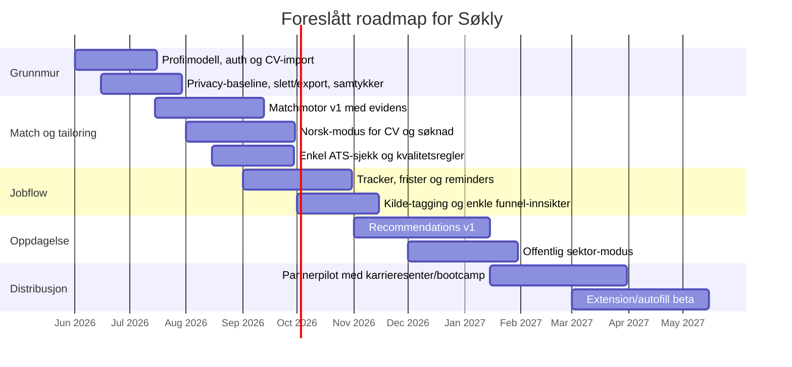

# Markedsanalyse — Søkly (mai 2026)

> Kilde: Deep-research-rapport, 8. mai 2026.
> Brukes som referanse for produkt- og GTM-beslutninger. Skal ikke endres uten ny analyse — oppdateringer skjer som tillegg eller ny versjon.

---

## TL;DR

Det norske jobbsøkermarkedet deler seg i tre: dokumentverktøy (CV/søknad), arbeidsrom (organisering) og automasjonsverktøy (auto-apply). AI-bruk er mainstream — FINN Jobbindeks 2025: ca. 1 av 3 jobbsøkere bruker AI; 86 % av rekrutterere merker det. Det betyr at "AI skriver søknaden for deg" alene ikke lenger er en posisjon.

**Strategisk anbefaling:** Søkly bør ikke være "enda en AI-generator", men et **norsk jobbsøker-operativsystem** — transparent match, norsk-modus for CV/søknad, jobflow/tracker, anbefalinger, og en personvernprofil enklere å stole på enn både lokale og globale alternativer.

---

## Direkte norske konkurrenter

| Prioritet | Aktør | Kjernefunksjoner | Pris | Styrker | Svakheter |
|---|---|---|---|---|---|
| Høy | **Søknadsbasen** | CV-bygger, AI-søknad, pipeline, oppgaver, ATS-PDF | 79 kr/mnd · 299/6 mnd | Tydeligst lokal "all-in-one"; sterk ATS- og privacy-fortelling | Svak på discovery og automasjon; Match Score lite dokumentert |
| Høy | **Lønna / Jobbe.ai** | Stillingsdatabase + lønnsdata, AI-søknad/CV, lønnskalk. | 89 kr 1. mnd · deretter 299/249 kr/mnd | Sterk discovery, lønnsvinkel, norsk språk | Dyrere; dual-brand-friksjon; mer komplekst vendor-bilde |
| Høy | **EnkelCV** | CV-maler, AI-skriving, match-analyse, tracker, intervju-prep | Gratis · Pro 39 kr/mnd | Mest aggressiv pris/ytelse; tydelig 0–100 matchscore | Mindre tydelig discovery/automasjon; ingen extension/autofill |
| Høy | **Cvenn** | CV-verktøy med stillingsanalyse, ATS-optimering, sporing | Ikke offentlig | Tydelig norsk; ATS-fokus; lagring i Skandinavia | Pris uklar; mindre om recommendations og bred workflow |
| Middels | **JobNavigator** | CV mot stilling, tilpassede søknader, karriereveiledning | 99 kr/mnd | Klart budskap rundt CV-vs-stilling | Få offentlige produktdetaljer |
| Middels | **Autosøk** | Aggregert jobbsøk, flere CV-profiler, AI-anbefalinger, Auto-Apply | Kredittbasert; 50/100/200/500 kr top-up | Tydeligst norsk automasjonsprodukt; sterk på recs + auto-innsending | Høy compliance-/tillitsterskel; svak på skrivekvalitet |
| Lavere | **Jobbfikser.no** | AI-søknad, CV-generator, polering | 1 gratis søknad; pris uklar | Enkel onboarding | Lite om match/tracking/discovery |
| Lavere | **Jobbsoknader.no** | AI-generert søknad + CV-eksempler, SEO-tung | "fra 59 kr" / "to pakker" / 199 kr (uklart) | Lav terskel; sterk SEO | Smalere produkt; prisuklarhet svekker tillit |
| Lavere (intl.) | **OwlApply** | AI-CV, ATS-check, match score, cover letters, board, tracker, extension, autofill (norsk lokalisert) | 7d for $2.95 · $17.49/mnd | Svært komplett; sterk på extension/autofill/ATS | Mindre norsk markedstilpasning; USD |

**Mønster:** Norske aktører er sterke på språk, lokal tone og enkel onboarding, men svakere på transparent match, anbefalingsmotorer og produktisert automasjon. Når automasjon kommer (Autosøk), øker tillits- og compliance-kravene betraktelig.

---

## Internasjonale referanser

| Aktør | Kjernefunksjoner | Pris | Norsk-svakhet |
|---|---|---|---|
| **Teal** | AI-CV, ATS-check, JD-match, tracker, extension, autofill, interview, networking-CRM | Gratis basis; Teal+ fra $9/uke, $29/30d, $79/90d | Ikke lokalisert; lite offentlig sektor-tilpasset |
| **Huntr** | AI-CV, tailored resumes, AI cover letters, tracker, contact/interview tracker, autofill, clipper | Gratis; Pro $40/mnd, $90/q, $160/6m | Høy pris i NOK; ingen lokal compliance |
| **Simplify** | Job matches, Copilot extension, autofill, tracker, AI-CV, recs | Gratis kjerne; Simplify+ uklart | Mindre lokal kontroll på språk/tillit |
| **Jobscan** | ATS-check, match-rate, CV-bygger, cover letter, LinkedIn-opt, tracker | Gratis (5 scans/mnd); Premium fra $49.95/mnd | Mindre helhetlig norsk jobflow |
| **Kickresume** | CV/letter builder, personal site, career map, ATS-check, AI-skriver | Gratis; ca. $24/mnd, $18/q, $8/mnd årlig | Ikke "job search OS"; svak på tracker/recs |

**Det internasjonale eier:** friksjonsfri extension/autofill, kraftig ATS- og match-lag, og brede tracker/CRM-flyter.
**Det norske eier:** språk, lokal tillit, lavere pris, forståelse for norsk søkepraksis.

---

## Funksjonskart og gap

| Søkly-kapabilitet | Status | Standardsetter | Hullet | Anbefalt posisjon |
|---|---|---|---|---|
| Match | God intl., ujevn lokalt | EnkelCV, Cvenn, JobNavigator, Teal, Jobscan | Få viser **krav-for-krav forklaring** med evidens fra CV/annonse | Match som signatur: transparent, norsk, handlingsrettet |
| CV/søknad tailoring | Crowded | Lønna, Søknadsbasen, EnkelCV, Huntr, Jobscan | Få viser **norsk skrivekonvensjon**, "uten søknadsbrev"-modus, kvalitetskontroll | Differensier på norsk tone, offentlig/privat-modus, kvalitetssjekk |
| Jobflow/tracker | Delvis dekket | Søknadsbasen, EnkelCV, Cvenn, Huntr, Teal | Få kombinerer tracking med **kildeinnsikt, frister, ritualer, neste handling** | Tracker som "jobflow OS" |
| Recommendations | Svak lokalt | Autosøk, Lønna, Simplify | Norske document-first-verktøy mangler troverdig anbefalingsmotor | Recs som løkke mellom match, tracking og discovery |
| Norwegian UX/privacy | Fragmentert | Søknadsbasen, Cvenn (trust); Lønna har detaljert policy men komplekst vendor-bilde | Ingen eier "**norsk arbeidsflyt + enkel trust-story + eksplisitt datakontroll**" | Privacy som produktlag, ikke juridisk fotnote |

**Hovedinnsikt:** Det viktigste gapet er ikke om Søkly kan generere tekst, men om Søkly kan binde sammen **discovery, match, tailoring, tracking og trust** i én norsk-preget arbeidsflyt.

---

## Differensieringsmuligheter (prioritert)

| Differensiering | Hva | Prioritet | Kompleksitet | KPI |
|---|---|---|---|---|
| **Transparent Match Score** | Krav-for-krav: dekket/delvis/mangler + evidens fra CV | Høy | Middels | Match-to-apply, score improvement, intervju-rate per score-bånd |
| **Norsk-modus for tailoring** | CV/søknad i norsk stil, privat/offentlig sektor, "uten søknadsbrev" | Høy | Middels | Akseptgrad, manuelle redigeringer, reuse-rate |
| **Jobflow OS** | Tracker = operativ prosess: frister, oppfølging, kilder, neste handling | Høy | Lav–middels | WAU, søknader/aktiv bruker, reminder-completion |
| **Privacy as a feature** | Datakontroll synlig: slett/eksporter, modellbruk, "ikke til trening"-løfte | Høy | Middels | Trial-to-paid, support tickets om personvern |
| **Norske anbefalinger** | Recs basert på profil + matchhistorikk + Arbeidsplassen/NAV + arbeidsgiversider | Høy | Høy | CTR, lagringsrate, apply-rate fra recs |
| **Offentlig sektor-lag** | Webcruiter/Jobbnorge-prosesser, søkerliste-realitet, friststyring | Middels | Middels | Konvertering i offentlig sektor |
| **Partnerskap/B2B2C** | Karrieresentre, bootcamps, fagforeninger | Middels | Høy | CAC fra partner, partner-seter |
| **Pris og GTM** | Generøs gratisdel + enkel Pro-plan i NOK; ikke credits-kaos | Middels | Lav | Free-to-paid, churn 30/90, ARPU |

---

## MVP-anbefaling

**Bygg først:** Profil/CV-import → Matchmotor v1 → Tailoring-studio → Jobflow/tracker → Recommendations v1.

**Bevisst utenfor MVP:** Full auto-apply, bred Chrome-extension, avansert intervjusimulator, B2B adminpanel, dypt analytics-lag.

Begrunnelse: Autosøk viser at full automasjon krever kredittsystem, e-postkontoer og tredjepartsregistreringer. OwlApply/Simplify er allerede langt fremme på autofill/extension. For en norsk portal er klokeste v1 å eie **match + norsk tailoring + jobflow + recommendations + trust** før man løfter automasjonsstacken.

---

## Foreslått roadmap (fra rapporten)

---

## Domenenavn, varemerke, neste steg

Sjekk **samlet** før navnet låses:

| Sjekk | Hvor | Hvorfor |
|---|---|---|
| Domenenavn | [Norid domeneoppslag](https://www.norid.no/), [Navnesøk](https://w2.brreg.no/navnesok/) | `.no` må avklares tidlig |
| Foretaksnavn | [Brønnøysundregistrene](https://www.brreg.no) (i tillegg til Navnesøk) | Altinn anbefaler dobbeltsjekk direkte |
| Varemerke | [Patentstyret](https://www.patentstyret.no) | Domene/foretak/varemerke har ulik beskyttelse |
| Konfliktsøk | Stavevarianter, ASCII, sosiale handles, app store | Reduserer rebrand-risiko |

---

## Anbefalt beslutning

Lås produktstrategien rundt **Søkly = norsk jobbsøker-operativsystem**, ikke AI-generator.

Bygg først: **CV-import → transparent match → norsk tailoring → tracker → recommendations**.

Gjør personvern, offentlig sektor-tilpasning og prisklarhet til aktive deler av produktet — ikke fotnoter.

---

## Kilder (utvalg)

- FINN Jobbindeks 2025 — søknadsbrevet er dødt
- Konkurrenter: Søknadsbasen, Lønna/Jobbe.ai, EnkelCV, Cvenn, JobNavigator, Autosøk, Jobbfikser.no, Jobbsoknader.no, OwlApply
- Internasjonale: Teal, Huntr, Simplify, Jobscan, Kickresume
- Altinn: valg av navn (domene → foretaksnavn → varemerke)
